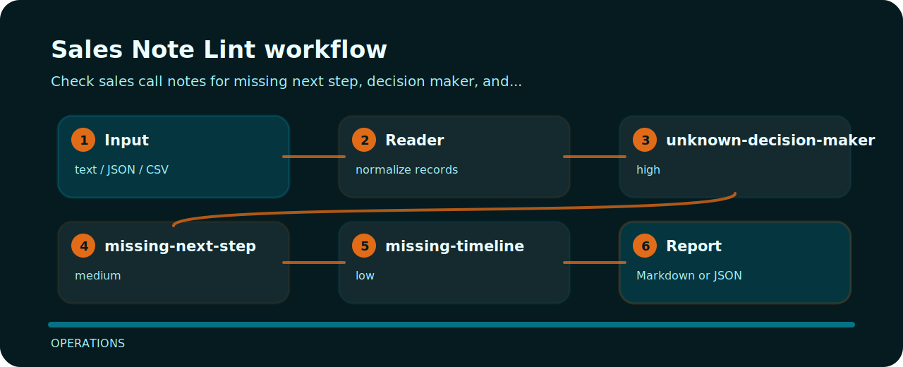

# Sales Note Lint

Check sales call notes for missing next step, decision maker, and timeline.


## Signal route



## Checks in plain language

- `unknown-decision-maker` - decision maker missing (high); identify buyer or sponsor.
- `missing-next-step` - next step missing (medium); record concrete follow-up.
- `missing-timeline` - timeline missing (low); capture buying timeline.

## Files to open first

```text
.github/        CI workflow
examples/       sample inputs
src/            package source
tests/          test coverage
```

## Command path

```bash
git clone https://github.com/mertefekurt/sales-note-lint.git
cd sales-note-lint
python -m pip install -e ".[dev]"
sales-note-lint examples/sample.txt
```
